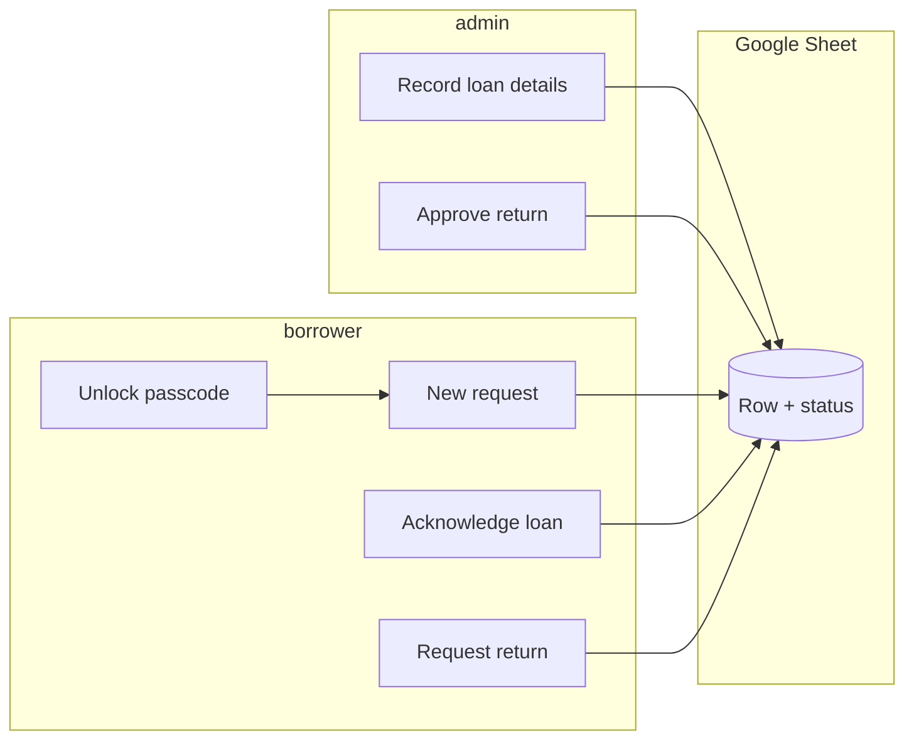

# VVC Telegram loan bot

A Telegram bot that records **equipment loan requests**, **two-sided confirmations** (logistics records what went out; borrower acknowledges), and **returns** with admin approval. Everything is stored in **Google Sheets** as an audit log—no LLM, rule-based messages only.

Use this in **private chat** with the bot (not groups).

---

## How it works (big picture)

1. **Borrower** unlocks the bot with a shared passcode (once per Telegram account on each server).
2. **Borrower** creates a **New request**: pick or type **CCA**, then send **item, qty, reason** (see format below). If `CCA_OPTIONS` is set in `.env`, CCAs appear as **buttons** instead of typing.
3. A new row appears in the sheet with status **pending_admin**.
4. **Admin** (logistics) opens **Admin: pending loans**, picks the request, and sends **what was actually loaned** in the same structured format.
5. The sheet updates; status becomes **awaiting_user_ack**, with timestamps and admin Telegram identity recorded.
6. **Borrower** opens **My loans** and taps **Sign / acknowledge** — that records their confirmation (“signature”) on the sheet.
7. Status becomes **on_loan**; borrower’s acknowledgement time is recorded.
8. When returning: **Borrower** uses **Return an item** → status **pending_return**.
9. **Admin** uses **Admin: pending returns** → approves → status **returned**, with approver and time recorded.

If a message does not match the required **three-part comma format**, the bot rejects it and shows the template again.



---

## Status values (column `status`)

| Status | Meaning |
|--------|---------|
| `pending_admin` | Request logged; logistics has not recorded what was loaned yet. |
| `awaiting_user_ack` | Logistics entered loan details; borrower must acknowledge under **My loans**. |
| `on_loan` | Borrower acknowledged; item is considered out on loan. |
| `pending_return` | Borrower started return; logistics has not confirmed yet. |
| `returned` | Logistics approved return; transaction closed on the sheet. |

---

## Message format: `item, qty, reason`

Both **borrower need** and **admin loan line** must be **one message** with **three parts**, separated by the **first two commas**:

- **Item** — what (trimmed).
- **Qty** — how many / how much (trimmed; can be text like `2` or `1 set`).
- **Reason** — why; **may include commas** (everything after the second comma counts as reason).

Examples:

- `HDMI cable, 2, Year-end concert booth`
- `Mic set A, 1, Signed from store — backup for assembly` (comma inside the reason is OK)

The bot stores **three columns each** for need and loan: `need_item`, `need_qty`, `need_reason`, and `loan_item`, `loan_qty`, `loan_reason`.

---

## Approvals vs signing (quick reference)

| Step | Who | Where in the bot | What happens on the sheet |
|------|-----|------------------|---------------------------|
| Approve the loan (logistics) | Admin | **Admin: pending loans** → pick row → send `item, qty, reason` | Fills loan columns + `loan_recorded_at`, status → `awaiting_user_ack` |
| Sign / acknowledge receipt | Borrower | **My loans** → **Sign / acknowledge** | Sets `user_ack_at`, status → `on_loan` |
| Approve return | Admin | **Admin: pending returns** → button | Sets `return_approved_*`, status → `returned` |

Use **`/admin`** in Telegram for a short reminder (admins only).

---

## Google Sheet columns

Row 1 must match the bot headers (created automatically on an empty sheet). **Older sheets** that still had `need_description` / `loan_description` are **migrated automatically** on the next bot start (rows are split into the new columns). **Back up the sheet** before the first run after upgrading, in case you need to undo something.

| Column | Purpose |
|--------|---------|
| `id` | Unique transaction id |
| `created_at` / `updated_at` | ISO timestamps (UTC) |
| `requester_*` | Borrower Telegram id, username, display name |
| `cca` | CCA / group |
| `need_item`, `need_qty`, `need_reason` | What they asked for (split fields) |
| `status` | One of the status values above |
| `loan_item`, `loan_qty`, `loan_reason` | What logistics recorded as loaned |
| `admin_*` / `loan_recorded_at` | Who recorded the loan and when |
| `user_ack_at` | When the borrower signed / acknowledged |
| `return_requested_at` | When return was started |
| `return_approved_at` | When logistics approved return |
| `return_approver_*` | Who approved the return |

---

## Who can do what

| Role | How it’s determined | Capabilities |
|------|---------------------|--------------|
| **Anyone** | Opens the bot on Telegram | Nothing useful until unlocked. |
| **Member** | Correct **BOT_PASSCODE** once | Menu: New request, My loans, Return an item. |
| **Admin** | Telegram user id in **ADMIN_TELEGRAM_IDS** | Same as member **plus** Admin: pending loans / pending returns. |

**Passcode notes:**

- Wrong guesses are counted; after **5** failures, that Telegram account waits **15 minutes** before trying again (in-memory; resets if the bot process restarts).
- Unlocked users are saved in **`verified_users.json`** on the machine running the bot (gitignored).

---

## Configuration

Copy `.env.example` to `.env` and fill in:

| Variable | Description |
|----------|-------------|
| `TELEGRAM_BOT_TOKEN` | From [@BotFather](https://t.me/BotFather) |
| `BOT_PASSCODE` | Shared unlock code (**≥ 12 characters**) |
| `ADMIN_TELEGRAM_IDS` | Comma-separated numeric Telegram user ids |
| `GOOGLE_SHEET_ID` | Spreadsheet id from the Google Sheet URL |
| `GOOGLE_SERVICE_ACCOUNT_FILE` | Path to the service account JSON key file |
| `CCA_OPTIONS` | Optional. Comma-separated labels (e.g. `Drama,Choir`). If set, **New request** shows buttons instead of asking for typed CCA. Avoid names that match menu labels like `Return an item`. |
| `VERIFIED_USERS_PATH` | Optional. Absolute path for `verified_users.json` on a server with a **persistent disk** (see hosting below). |

Share the Google Sheet with the **service account email** (`client_email` inside the JSON) as **Editor**.

Never commit `.env`, `service_account.json`, or `verified_users.json`.

---

## Run locally

```bash
pip install -r requirements.txt
python bot.py
```

Keep the process running for the bot to stay online (your laptop, a VPS, or a host like Railway/Fly.io). Prefer **one** running instance per deployment so `verified_users.json` stays consistent.

---

## Hosting 24/7 (Railway or Render)

These platforms **sleep** or **rotate disks** by default; Telegram bots need a **long-running process** and a **stable** `verified_users.json` if you do not want members to re-enter the passcode after every deploy.

### General

1. Push the repo to GitHub (without `.env` or keys).
2. Create a new project and connect the repo.
3. Set **build**: `pip install -r requirements.txt`
4. Set **start command**: `python bot.py` (this repo includes a `Procfile` with `worker: python bot.py` for platforms that read it).
5. Copy every variable from your local `.env` into the host’s **environment variables** (same names).
6. Upload **`service_account.json`** securely: many hosts let you paste file contents in a secret, or mount it — point `GOOGLE_SERVICE_ACCOUNT_FILE` at that path.

### Railway

1. [railway.app](https://railway.app) → New Project → Deploy from GitHub.
2. Add **Variables** for `TELEGRAM_BOT_TOKEN`, `BOT_PASSCODE`, `ADMIN_TELEGRAM_IDS`, `GOOGLE_SHEET_ID`, `GOOGLE_SERVICE_ACCOUNT_FILE`, optional `CCA_OPTIONS`, etc.
3. For `service_account.json`, use **Railway’s file mount / variable** pattern or commit a path under a mounted volume (do **not** commit the JSON to GitHub).
4. Optional **Volume**: mount e.g. `/data` and set `VERIFIED_USERS_PATH=/data/verified_users.json` so unlocks survive redeploys.
5. Start command: `python bot.py` (or rely on `Procfile` **worker** process type if the UI offers it).

### Render

1. [render.com](https://render.com) → New → **Background Worker** (not a Web Service — this bot uses **polling**, not HTTP).
2. Connect the repo; build command `pip install -r requirements.txt`; start command `python bot.py`.
3. Add the same env vars as locally.
4. Free tier may **spin down** or be unsuitable for always-on bots; check current Render policies. Consider a paid worker or another VPS if the bot must never stop.
5. If Render provides a **persistent disk**, attach it and set `VERIFIED_USERS_PATH` to a file on that disk.

### Why `VERIFIED_USERS_PATH` matters

On many hosts the filesystem is **ephemeral**: each deploy wipes `verified_users.json`. Setting `VERIFIED_USERS_PATH` to a **mounted volume** path keeps “already unlocked” users across deploys.

---

## Commands

| Command | Purpose |
|---------|---------|
| `/start` | Introduction, how it fits together; if not unlocked, asks for passcode |
| `/help` | Full step-by-step guide (borrowers + admin section if you’re an admin) |
| `/admin` | Short logistics reminder (admins only) |

---

## Tech stack

- **Python**, **python-telegram-bot** (long polling)
- **gspread** + Google service account for Sheets

---

## Limitations

- **Shared passcode**: anyone with the code can unlock; rotate it if it leaks.
- **Single-server file**: `verified_users.json` is local to the host unless you redesign storage.

---

## License

Specify your license here if you publish the repo.
