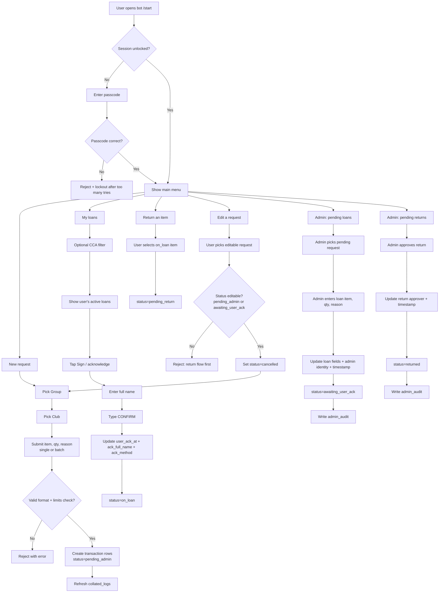

# VVC Telegram loan bot

A Telegram bot that records **equipment loan requests**, **two-sided confirmations** (logistics records what went out; borrower acknowledges), and **returns** with admin approval. Everything is stored in **Google Sheets** as an audit log—no LLM, rule-based messages only.

Use this in **private chat** with the bot (not groups).

---

## How it works (big picture)

1. **Borrower** unlocks the bot with a shared passcode (session-based).
2. **Borrower** creates a **New request**: pick **Group** and **Club** from buttons, then send **item, qty, reason** (see format below).
3. A new row appears in the sheet with status **pending_admin**.
4. **Admin** (logistics) opens **Admin: pending loans**, picks the request, and sends **what was actually loaned** in the same structured format.
5. The sheet updates; status becomes **awaiting_user_ack**, with timestamps and admin Telegram identity recorded.
6. **Borrower** opens **My loans** and taps **Sign / acknowledge**, enters full name, then types `CONFIRM`.
7. Status becomes **on_loan**; borrower’s acknowledgement time is recorded.
8. When returning: **Borrower** uses **Return an item** → status **pending_return**.
9. **Admin** uses **Admin: pending returns** → approves → status **returned**, with approver and time recorded.

If a message does not match the required **three-part comma format**, the bot rejects it and shows the template again.



---

## Status values (column `status`)

| Status | Meaning |
|--------|---------|
| `pending_admin` | Request logged; logistics has not recorded what was loaned yet. |
| `awaiting_user_ack` | Logistics entered loan details; borrower must acknowledge under **My loans**. |
| `on_loan` | Borrower acknowledged; item is considered out on loan. |
| `pending_return` | Borrower started return; logistics has not confirmed yet. |
| `returned` | Logistics approved return; transaction closed on the sheet. |

---

## Message format: `item, qty, reason`

Both **borrower need** and **admin loan line** must be **one message** with **three parts**, separated by the **first two commas**:

- **Item** — what (trimmed).
- **Qty** — how many / how much (trimmed; can be text like `2` or `1 set`).
- **Reason** — why; **may include commas** (everything after the second comma counts as reason).

Examples:

- `HDMI cable, 2, Year-end concert booth`
- `Mic set A, 1, Signed from store — backup for assembly` (comma inside the reason is OK)

The bot stores **three columns each** for need and loan: `need_item`, `need_qty`, `need_reason`, and `loan_item`, `loan_qty`, `loan_reason`.

---

## Approvals vs signing (quick reference)

| Step | Who | Where in the bot | What happens on the sheet |
|------|-----|------------------|---------------------------|
| Approve the loan (logistics) | Admin | **Admin: pending loans** → pick row → send `item, qty, reason` | Fills loan columns + `loan_recorded_at`, status → `awaiting_user_ack` |
| Sign / acknowledge receipt | Borrower | **My loans** → **Sign / acknowledge** → full name + `CONFIRM` | Sets `user_ack_at`, `ack_full_name`, `ack_method`, status → `on_loan` |
| Approve return | Admin | **Admin: pending returns** → button | Sets `return_approved_*`, status → `returned` |

Use **`/admin`** in Telegram for a short reminder (admins only).

---

## Google Sheet columns

Row 1 must match the bot headers (created automatically on an empty sheet). **Older sheets** that still had `need_description` / `loan_description` are **migrated automatically** on the next bot start (rows are split into the new columns). **Back up the sheet** before the first run after upgrading, in case you need to undo something.

| Column | Purpose |
|--------|---------|
| `id` | Unique transaction id |
| `created_at` / `updated_at` | ISO timestamps (UTC) |
| `requester_*` | Borrower Telegram id, username, display name |
| `cca` | CCA / group |
| `need_item`, `need_qty`, `need_reason` | What they asked for (split fields) |
| `status` | One of the status values above |
| `loan_item`, `loan_qty`, `loan_reason` | What logistics recorded as loaned |
| `admin_*` / `loan_recorded_at` | Who recorded the loan and when |
| `user_ack_at`, `ack_full_name`, `ack_method` | Borrower signature data |
| `return_requested_at` | When return was started |
| `return_approved_at` | When logistics approved return |
| `return_approver_*` | Who approved the return |

The bot also maintains a second worksheet named **`collated_logs`** that aggregates total requested quantities by item across all requests.
You can optionally maintain:
- **`limits`** (`item`, `max_outstanding_qty`) to enforce per-CCA outstanding caps (active statuses only: pending_admin, awaiting_user_ack, on_loan, pending_return).
- **`item_aliases`** (`alias`, `canonical_item`) to merge naming variants (e.g. `tables` -> `table`) for caps/collation.

---

## Who can do what

| Role | How it’s determined | Capabilities |
|------|---------------------|--------------|
| **Anyone** | Opens the bot on Telegram | Nothing useful until unlocked. |
| **Member** | Correct **BOT_PASSCODE** once | Menu: New request, My loans, Return an item. |
| **Admin** | Telegram user id in **ADMIN_TELEGRAM_IDS** | Same as member **plus** Admin: pending loans / pending returns. |

**Passcode notes:**

- Wrong guesses are counted; after **5** failures, that Telegram account waits **15 minutes** before trying again (in-memory; resets if the bot process restarts).
- Unlock is session-based: after inactivity (`SESSION_TTL_MINUTES`), users must enter passcode again.

---

## Configuration

Copy `.env.example` to `.env` and fill in:

| Variable | Description |
|----------|-------------|
| `TELEGRAM_BOT_TOKEN` | From [@BotFather](https://t.me/BotFather) |
| `BOT_PASSCODE` | Shared unlock code (**≥ 12 characters**) |
| `ADMIN_TELEGRAM_IDS` | Comma-separated numeric Telegram user ids |
| `GOOGLE_SHEET_ID` | Spreadsheet id from the Google Sheet URL |
| `GOOGLE_SERVICE_ACCOUNT_FILE` | Path to the service account JSON file (local / file on disk) |
| `GOOGLE_SERVICE_ACCOUNT_JSON` | Optional. Entire JSON body as one env value (use on Render instead of a file). If set, it overrides the file. |
| `SESSION_TTL_MINUTES` | Optional. Session timeout in minutes. After inactivity, passcode is required again. |

Share the Google Sheet with the **service account email** (`client_email` inside the JSON) as **Editor**.

Never commit `.env` or `service_account.json`.

---

## Run locally

```bash
pip install -r requirements.txt
python bot.py
```

Keep the process running for the bot to stay online (your laptop, a VPS, or a host like Railway/Fly.io). Prefer **one** running instance per deployment.

---

## Hosting 24/7 (Railway or Render)

Telegram needs a **single long-running process** (`python bot.py`). Prefer **one** deployment.

### General

1. Push the repo to GitHub (no `.env`, no `service_account.json`, no `verified_users.json`).
2. Build: `pip install -r requirements.txt` · Start: `python bot.py` (see also `Procfile`).
3. Copy env vars from `.env`. For Google credentials you can either:
   - **`GOOGLE_SERVICE_ACCOUNT_JSON`** — paste the **full** service account JSON (recommended on Render), or  
   - **`GOOGLE_SERVICE_ACCOUNT_FILE`** — path to the JSON file on disk (typical locally).

### Railway

1. [railway.app](https://railway.app) → New Project → Deploy from GitHub.
2. Set variables and start command `python bot.py`.
3. Start command: `python bot.py`.

### Render (step-by-step)

Render’s Blueprint spec: **background workers cannot use the “Free” instance type** — you need at least **Starter** (check [current pricing](https://render.com/pricing)).

1. Push this repo to GitHub.
2. In [render.com](https://render.com) → **New** → **Blueprint** (or **Background Worker** from repo).
3. Connect the repo. If you use the included **`render.yaml`**, Render will propose a **Worker** with the correct build/start commands.
4. **Environment variables** (set in the dashboard; mark secrets appropriately):
   - `TELEGRAM_BOT_TOKEN`, `BOT_PASSCODE`, `ADMIN_TELEGRAM_IDS`, `GOOGLE_SHEET_ID`
   - **`GOOGLE_SERVICE_ACCOUNT_JSON`** — open your local `service_account.json`, copy **all** of it, paste into one secret (multiline). You do **not** need to upload the file if this is set.
   - Optional: `SESSION_TTL_MINUTES`
5. **Do not** create a **Web Service** for this bot — it does not listen on HTTP. Use a **Background Worker**.
6. Deploy and watch **Logs**. If the worker crashes on boot, check env vars and that the Sheet is shared with the service account email from the JSON.

`runtime.txt` pins the Python version for Render’s Python runtime.

### Session timeout behavior

Unlock is intentionally temporary. After `SESSION_TTL_MINUTES` of inactivity, members must enter passcode again.

---

## Commands

| Command | Purpose |
|---------|---------|
| `/start` | Introduction, how it fits together; if not unlocked, asks for passcode |
| `/help` | Full step-by-step guide (borrowers + admin section if you’re an admin) |
| `/whoami` | Show your Telegram ID, role (admin/member), and session status |
| `/status <tx_id>` | Show status/details of one transaction (admin: any, member: own only) |
| `/cancelreq <tx_id>` | Cancel mistaken request before/while approval (not after on-loan/returned) |
| `/editreq <tx_id>` | User-only edit flow: cancel own `pending_admin` request and immediately re-submit |
| `/admin` | Short logistics reminder (admins only) |
| `/adminlog` | Show latest admin audit entries (admins only) |
| `/pending` | Queue summary counts (admins only) |

---

## Tech stack

- **Python**, **python-telegram-bot** (long polling)
- **gspread** + Google service account for Sheets

---

## Limitations

- **Shared passcode**: anyone with the code can unlock; rotate it if it leaks.
- **Session timeout**: users need to re-enter passcode after inactivity by design.

---

## License

Specify your license here if you publish the repo.
