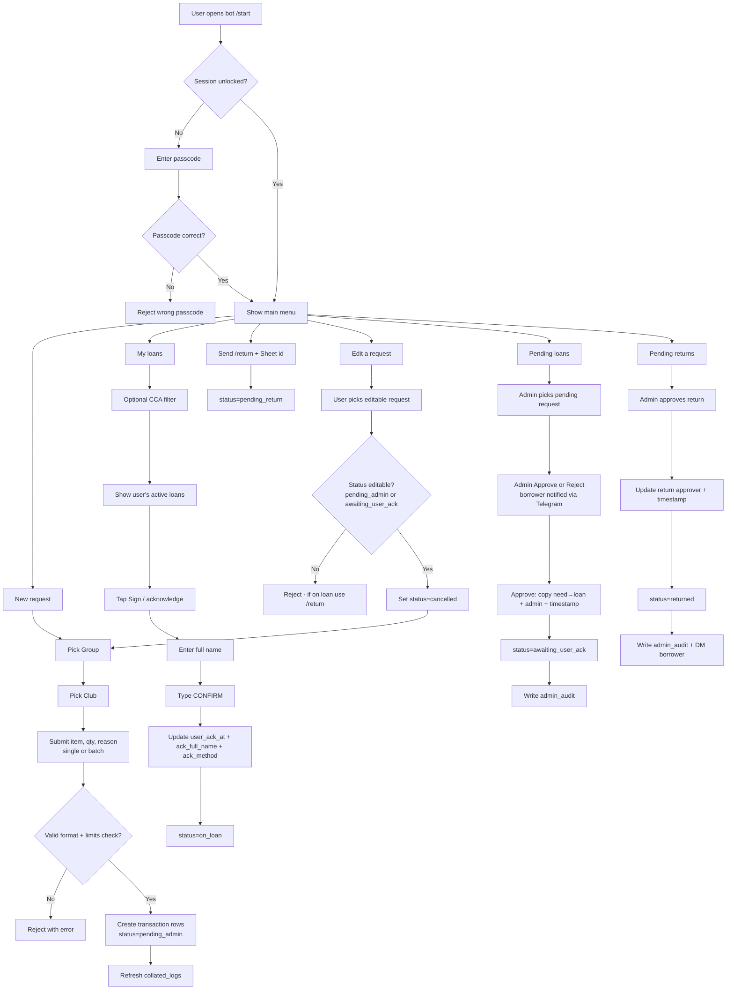

# VVC Telegram loan bot

A Telegram bot that records **equipment loan requests**, **logistics approve/reject** with **Telegram notifications**, **borrower acknowledgement** after approval, and **returns** with admin approval. Everything is stored in **Google Sheets** as an audit log—no LLM, rule-based messages only.

Use this in **private chat** with the bot (not groups).

---

## Responsiveness (lag, many requests, steps)

- **Lag:** Most actions read or write **Google Sheets** over the network, so a short pause before the next bot message is normal. Loan approve/reject and return confirmation update the sheet first, then the borrower is messaged.
- **Fewer waits for borrowers:** Paste **many** `item, qty, reason` lines in **one** message; the bot appends them in a **single batch** to the Sheet (one collated refresh), which is much faster than sending one item per message.
- **Admins:** Each transaction still needs **its own Approve** tap (audit trail). Use **Search** (`/find`) instead of scrolling the Sheet. Under heavy load the bot handles **one Telegram update at a time** — queues take longer to clear, but the process does not “fall over” like an overloaded web form.

---

## How it works (big picture)

1. **Borrower** unlocks the bot with a shared passcode (session-based, and only during operating hours if enabled).
2. **Borrower** creates a **New request**: pick **Group** and **Club** from buttons, then send one or more lines **`item, qty, reason`** (see format below; many lines can go in one message).
3. A new row appears in the sheet with status **pending_admin**.
4. **Admin** (logistics) opens **Pending loans** on the keyboard and taps **Approve** or **Reject** (or uses `/recordloan` / `/rejectloan`). Borrowers get a **Telegram DM** either way. Approve copies the request onto the loan columns and moves the row to awaiting signature.
5. The sheet updates; status becomes **awaiting_user_ack**, with timestamps and admin Telegram identity recorded.
6. **Borrower** opens **My loans** and taps **Sign / acknowledge**, enters full name, then types `CONFIRM`.
7. Status becomes **on_loan**; borrower’s acknowledgement time is recorded.
8. When returning: **Borrower** sends **`/return <transaction_id>`** (id from the Sheet log or My loans) → status **pending_return**.
9. **Admin** uses **Pending returns** → approves → status **returned**, with approver and time recorded; **borrower gets a Telegram DM** confirming the return.

If a message does not match the required **three-part comma format**, the bot rejects it and shows the template again.

### Super-short user version

1. Send passcode in private chat.
2. Tap **New request**.
3. Send one or more lines: `item, qty, reason` per line (example: `HDMI cable, 2, rehearsal`). You can paste **many lines in one message** or copy rows from a spreadsheet (max 40 lines).
4. Wait for logistics approval.
5. If approved, open **My loans** and sign (name + `CONFIRM`).
6. When returning, send `/return <tx_id>`.



---

## Status values (column `status`)

| Status | Meaning |
|--------|---------|
| `pending_admin` | Request logged; logistics has not approved or rejected yet. |
| `awaiting_user_ack` | Logistics approved (loan line matches request); borrower must acknowledge under **My loans**. |
| `on_loan` | Borrower acknowledged; item is considered out on loan. |
| `pending_return` | Borrower started return; logistics has not confirmed yet. |
| `returned` | Logistics approved return; transaction closed on the sheet. |

---

## Message format: `item, qty, reason`

**Borrowers** submit **need** lines as **one line per item**, **three parts** separated by the **first two commas**. A **single message** may contain **many lines** (batch paste); each line becomes one sheet row / transaction.

- **Item** — what (trimmed).
- **Qty** — how many / how much (trimmed; can be text like `2` or `1 set`).
- **Reason** — why; **may include commas** (everything after the second comma counts as reason).

Examples:

- `HDMI cable, 2, Year-end concert booth`
- `Mic set A, 1, Signed from store — backup for assembly` (comma inside the reason is OK)

Batch in one message (each line = one request):

```text
HDMI cable, 2, Year-end concert booth
Extension cord, 1, Stage setup
```

The bot stores **three columns each** for need and loan: `need_item`, `need_qty`, `need_reason`, and `loan_item`, `loan_qty`, `loan_reason`. On **Approve**, logistics copies **need→loan** (same wording) unless you edit the sheet manually later.

---

## Approvals vs signing (quick reference)

| Step | Who | Where in the bot | What happens on the sheet |
|------|-----|------------------|---------------------------|
| Approve the loan (logistics) | Admin | **Pending loans** → **Approve**, or `/recordloan <tx_id>` | Copies need→loan columns + admin + timestamp; statuses → `awaiting_user_ack`; **DMs borrower** |
| Decline request | Admin | **Reject**, or `/rejectloan <tx_id>` | Status → `cancelled`; **DMs borrower** |
| Sign / acknowledge receipt | Borrower | **My loans** → **Sign / acknowledge** → full name + `CONFIRM` | Sets `user_ack_at`, `ack_full_name`, `ack_method`, status → `on_loan` |
| Start return | Borrower | **`/return <tx_id>`** — paste id from Sheet log or **My loans** | Sets `return_requested_at`, status → `pending_return` |
| Approve return | Admin | **Pending returns** → button | Sets `return_approved_*`, status → `returned`; **DMs borrower** (thanks / closed) |

Use **`/admin`** in Telegram for a short reminder (admins only).

---

## Google Sheet columns

Row 1 must match the bot headers (created automatically on an empty sheet). **Older sheets** that still had `need_description` / `loan_description` are **migrated automatically** on the next bot start (rows are split into the new columns). **Back up the sheet** before the first run after upgrading, in case you need to undo something.

| Column | Purpose |
|--------|---------|
| `id` | Unique transaction id |
| `created_at` / `updated_at` | ISO timestamps (UTC) |
| `requester_*` | Borrower Telegram id, username, display name |
| `cca` | CCA / group |
| `need_item`, `need_qty`, `need_reason` | What they asked for (split fields) |
| `status` | One of the status values above |
| `loan_item`, `loan_qty`, `loan_reason` | What logistics recorded as loaned |
| `admin_*` / `loan_recorded_at` | Who recorded the loan and when |
| `user_ack_at`, `ack_full_name`, `ack_method` | Borrower signature data |
| `return_requested_at` | When return was started |
| `return_approved_at` | When logistics approved return |
| `return_approver_*` | Who approved the return |

After a successful connection, the bot may create **`bot_quickref`** once: a plain-English recap of statuses, **`id`** usage (**`/return`**, **`/status`**, admin commands), and sign-off before returning. Existing tabs are left alone unless a tab’s header row is empty or malformed (then row 1 is repaired to match the bot).

The bot also maintains a second worksheet named **`collated_logs`** that aggregates total requested quantities by item across all requests.
You can optionally maintain:
- **`limits`** (`item`, `max_outstanding_qty`) to enforce per-CCA outstanding caps (active statuses only: pending_admin, awaiting_user_ack, on_loan, pending_return).
- **`item_aliases`** (`alias`, `canonical_item`) to merge naming variants (e.g. `tables` -> `table`) for caps/collation.

---

## Who can do what

| Role | How it’s determined | Capabilities |
|------|---------------------|--------------|
| **Anyone** | Opens the bot on Telegram | Nothing useful until unlocked. |
| **Member** | Correct **BOT_PASSCODE** once | Menu: New request, My loans, Edit a request · returns via **`/return <tx_id>`**. |
| **Admin** | Telegram user id in **ADMIN_TELEGRAM_IDS** | Same as member **plus** Pending loans / Pending returns queues. |

**Passcode notes:**

- Wrong passcode returns troubleshooting hints (check latest passcode in Logs, check typo/case/spacing, contact logistics if bot may be down).
- Unlock is session-based: after inactivity (`SESSION_TTL_MINUTES`), users must enter passcode again.

---

## Configuration

Copy `.env.example` to `.env` and fill in:

| Variable | Description |
|----------|-------------|
| `TELEGRAM_BOT_TOKEN` | From [@BotFather](https://t.me/BotFather) |
| `BOT_PASSCODE` | Shared unlock code (**≥ 12 characters**) |
| `ADMIN_TELEGRAM_IDS` | Comma-separated numeric Telegram user ids |
| `GOOGLE_SHEET_ID` | Spreadsheet id from the Google Sheet URL |
| `GOOGLE_SERVICE_ACCOUNT_FILE` | Path to the service account JSON file (local / file on disk) |
| `GOOGLE_SERVICE_ACCOUNT_JSON` | Optional. Entire JSON body as one env value (use on Render instead of a file). If set, it overrides the file. |
| `SESSION_TTL_MINUTES` | Optional. Session timeout in minutes. After inactivity, passcode is required again. |
| `OPERATING_HOURS_ENABLED` | Optional. `true/false`. If `true`, the bot auto-replies as inactive outside hours. |
| `OPENING_HOUR_24` / `CLOSING_HOUR_24` | Optional. Hours in UTC+8 (0..23). Example `9` and `21` means 09:00 to 21:00. |

Share the Google Sheet with the **service account email** (`client_email` inside the JSON) as **Editor**.

Never commit `.env` or `service_account.json`.

---

## Run locally

```bash
pip install -r requirements.txt
python bot.py
```

Keep the process running for the bot to stay online (your laptop, a VPS, or a host like Railway/Fly.io). Prefer **one** running instance per deployment.

---

## Hosting 24/7 (Railway or Render)

Telegram needs a **single long-running process** (`python bot.py`). Prefer **one** deployment.

### General

1. Push the repo to GitHub (no `.env`, no `service_account.json`, no `verified_users.json`).
2. Build: `pip install -r requirements.txt` · Start: `python bot.py` (see also `Procfile`).
3. Copy env vars from `.env`. For Google credentials you can either:
   - **`GOOGLE_SERVICE_ACCOUNT_JSON`** — paste the **full** service account JSON (recommended on Render), or  
   - **`GOOGLE_SERVICE_ACCOUNT_FILE`** — path to the JSON file on disk (typical locally).

### Railway

1. [railway.app](https://railway.app) → New Project → Deploy from GitHub.
2. Set variables and start command `python bot.py`.
3. Start command: `python bot.py`.

### Render (step-by-step)

Render’s Blueprint spec: **background workers cannot use the “Free” instance type** — you need at least **Starter** (check [current pricing](https://render.com/pricing)).

1. Push this repo to GitHub.
2. In [render.com](https://render.com) → **New** → **Blueprint** (or **Background Worker** from repo).
3. Connect the repo. If you use the included **`render.yaml`**, Render will propose a **Worker** with the correct build/start commands.
4. **Environment variables** (set in the dashboard; mark secrets appropriately):
   - `TELEGRAM_BOT_TOKEN`, `BOT_PASSCODE`, `ADMIN_TELEGRAM_IDS`, `GOOGLE_SHEET_ID`
   - **`GOOGLE_SERVICE_ACCOUNT_JSON`** — open your local `service_account.json`, copy **all** of it, paste into one secret (multiline). You do **not** need to upload the file if this is set.
   - Optional: `SESSION_TTL_MINUTES`
5. **Do not** create a **Web Service** for this bot — it does not listen on HTTP. Use a **Background Worker**.
6. Deploy and watch **Logs**. If the worker crashes on boot, check env vars and that the Sheet is shared with the service account email from the JSON.

`runtime.txt` pins the Python version for Render’s Python runtime.

### Session timeout behavior

Unlock is intentionally temporary. After `SESSION_TTL_MINUTES` of inactivity, members must enter passcode again.

---

## Commands

| Command | Purpose |
|---------|---------|
| `/start` | Introduction, how it fits together; if not unlocked, asks for passcode |
| `/help` | Full step-by-step guide (borrowers + admin section if you’re an admin) |
| `/whoami` | Show your Telegram ID, role (admin/member), and session status |
| `/status <tx_id>` | Show status/details of one transaction (admin: any, member: own only) |
| `/find` | **Admins only** — search Sheet rows in chat: `/find tg <id>`, `/find club <text>`, etc. Borrowers use **My loans** for their items. |
| `/cancelreq <tx_id>` | Cancel mistaken request before/while approval (not after on-loan/returned) |
| `/editreq <tx_id>` | User-only edit flow: cancel own `pending_admin` request and immediately re-submit |
| `/return <tx_id>` | Borrower: start return with Sheet **`id`** (or unique hex prefix); must own the row and be **`on_loan`** |
| `/admin` | Short logistics reminder (admins only) |
| `/adminlog` | Show latest admin audit entries (admins only) |
| `/pending` | Queue summary counts (admins only) |
| `/recordloan <tx_id>` | Approve one pending loan by Sheet **id** or unique hex prefix (admins only) |
| `/rejectloan <tx_id>` | Reject one pending loan the same way (admins only) |
| `/backupnow` | Create a timestamped backup worksheet snapshot (admins only) |

---

## Tech stack

- **Python**, **python-telegram-bot** (long polling)
- **gspread** + Google service account for Sheets

---

## Limitations

- **Shared passcode**: anyone with the code can unlock; rotate it if it leaks.
- **Session timeout**: users need to re-enter passcode after inactivity by design.

---

## License

Specify your license here if you publish the repo.
